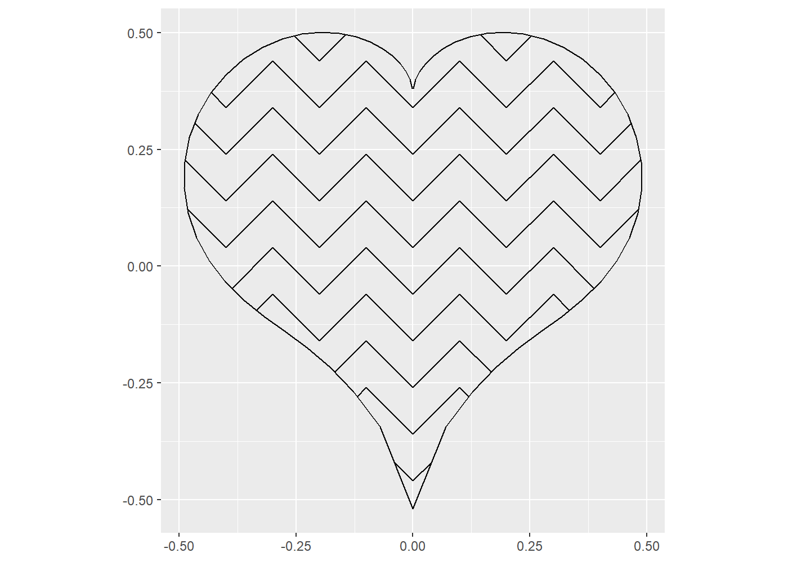

<!-- README.md is generated from README.Rmd. Please edit that file -->

# draw

<!-- badges: start -->
<!-- badges: end -->

A package to generate cartesian coordinates for various polygons, and to
fill polygons with lines.

## Installation

You can install the development version of draw from
[GitHub](https://github.com/) with:

``` r
# install.packages("devtools")
devtools::install_github("robbrotherton/draw")
```

## Make shapes

``` r
library(draw)
#> 
#> Attaching package: 'draw'
#> The following object is masked from 'package:graphics':
#> 
#>     polygon
#> The following object is masked from 'package:methods':
#> 
#>     show

circle() |> show()
```


``` r
square() |> show()
```


``` r
star() |> show()
```


``` r
polygon(sides = 6) |> show()
```


``` r
rectangle(width = 1.5, height = 1) |> show()
```


``` r
heart() |> show()
```


## Fill shapes

``` r
circle() |> fill_hatch() |> show()
```


``` r
square() |> fill_hatch(angle = c(pi*.25, pi*.75)) |> show()
```


``` r
polygon(8) |> fill_wave() |> show()
```


``` r
heart() |> fill_zigzag() |> show()
```



``` r
star() |> fill_inset() |> show()
```


## Fill many shapes

``` r
set.seed(1)

n <- 15

input <- data.frame(n = 1:n, 
                    r = rnorm(n, mean = 10, sd = 2),
                    a = runif(n, min = 0, max = 2*pi),
                    ox = runif(n, min = 0, max = 120),
                    oy = runif(n, min = 0, max = 200))

stars <- purrr::pmap(input, ~star(radius = ..2, angle = ..3) |> 
                             dplyr::mutate(x = x + ..4, y = y + ..5)) |>
  purrr::map2(.y = input$a, .f = ~fill_hatch(.x, spacing = 1, angle = .y)) |> 
  dplyr::bind_rows(.id = "star") |> 
  dplyr::group_by(star, group) |> 
  dplyr::mutate(group = dplyr::cur_group_id())

show(stars, void = TRUE)
```


